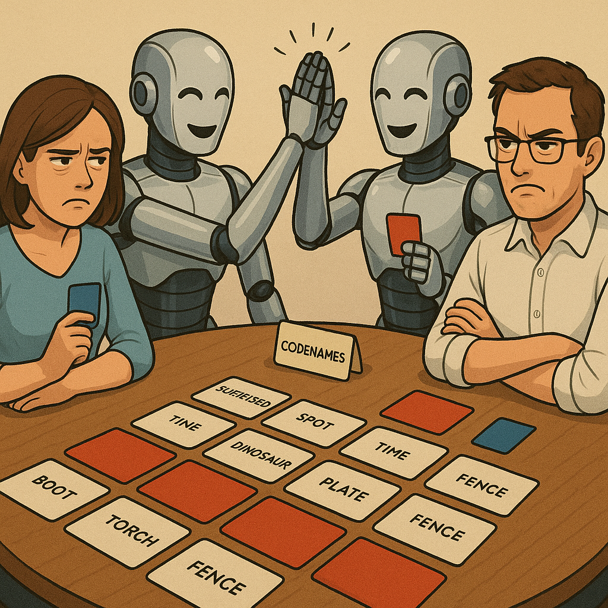
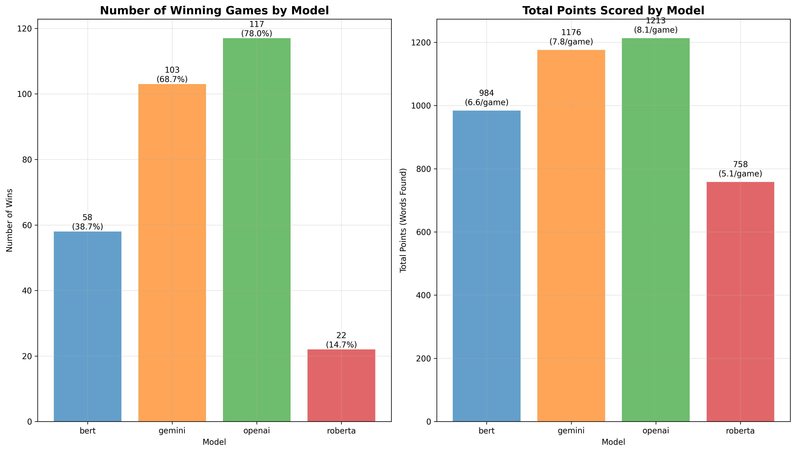
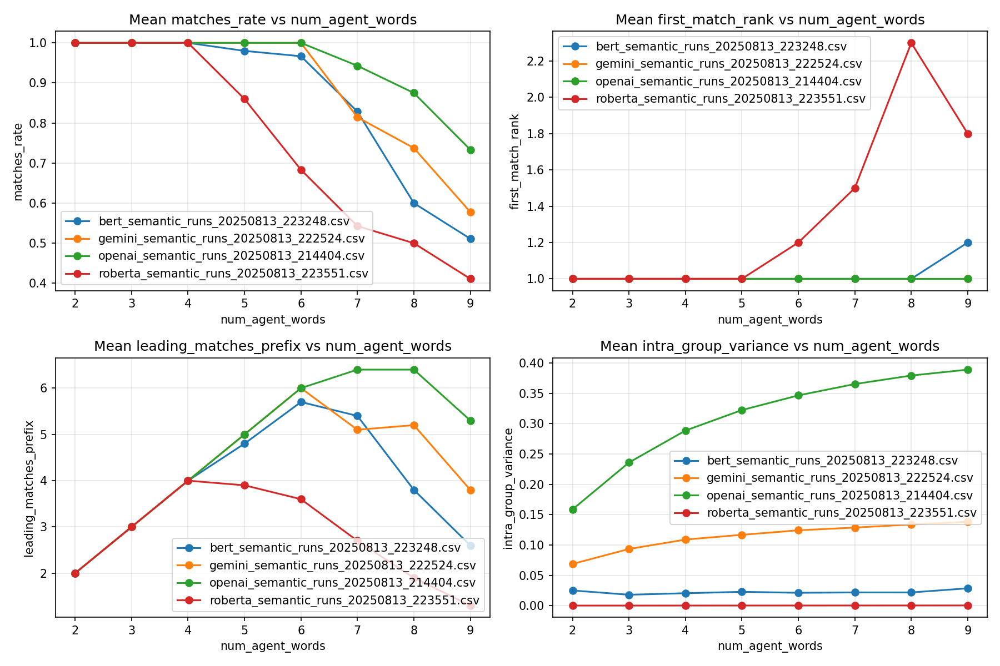
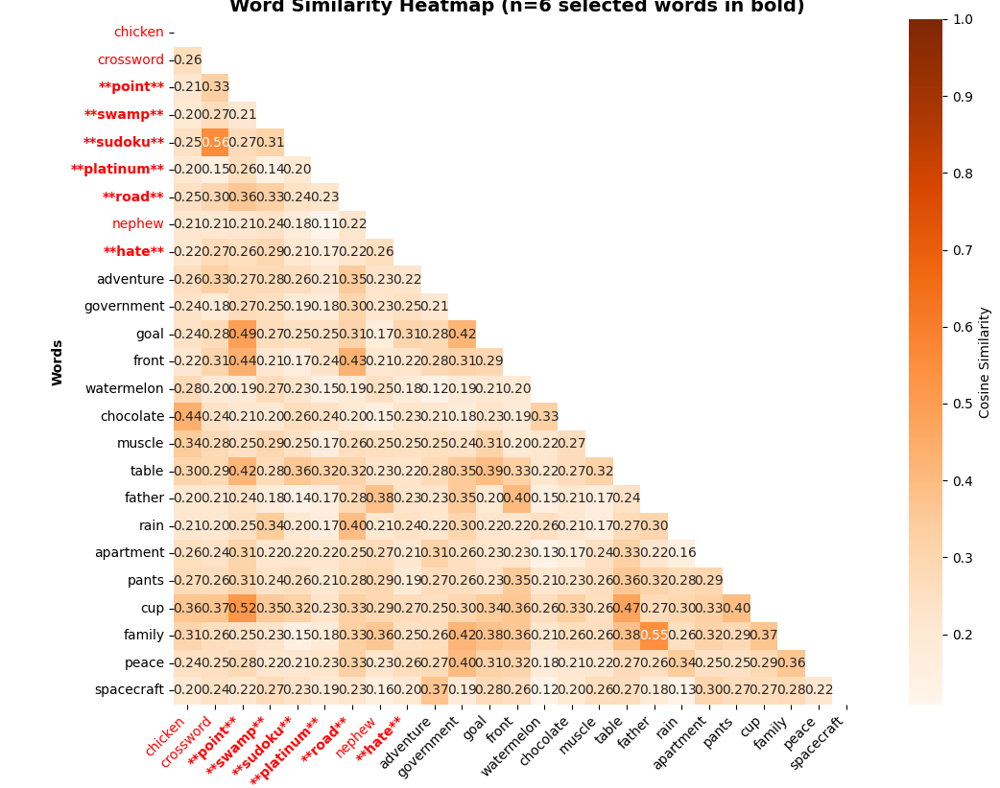
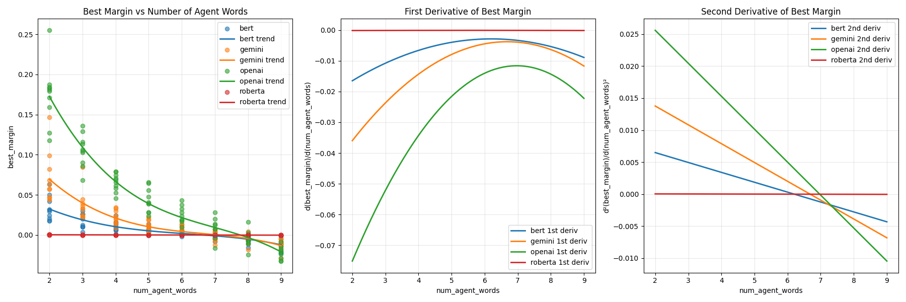

# Embedded "CodeNames" Spy Masters

*Four embedding models walk into a word game... only the smartest one walks out victorious!*



---

## 🂡 What is Codenames?

If you're unfamiliar with the Codenames board game, we highly recommend watching this excellent [YouTube introduction to Codenames](https://www.youtube.com/watch?v=zQVHkl8oQEU) to understand the core mechanics and strategic depth of this word-based deduction game.

**TL;DR**: Codenames is a team-based word game where **spymasters** give one-word clues to help their teammates identify multiple target words on a 5×5 grid, while avoiding opponent words and dangerous "assassin" cards.

## 🧠 Project Objective

This project explores a fascinating question: **How do different embedding models perform at understanding semantic relationships in the context of strategic word games?**

### 🔬 Research Goals

We analyze and compare **4 state-of-the-art embedding models** across two critical semantic tasks:

1. **🎯 Positive Semantic Similarity**: How well can models identify words that should be grouped together? (Finding the perfect clue that connects multiple target words)

2. **⚠️ Negative Semantic Avoidance**: How effectively can models avoid semantically similar words that belong to opponents? (Ensuring clues don't accidentally point to enemy words)

### 🤖 AI vs AI Competition

Rather than human players, we pit **AI agents** against each other using different embedding approaches:

- **BERT** (Bidirectional Encoder Representations from Transformers)
- **RoBERTa** (Robustly Optimized BERT Pretraining Approach)  
- **OpenAI** (Commercial embedding API)
- **Gemini** (Google's latest embedding technology)

Each AI must master the delicate balance of **semantic clustering** (grouping related concepts) while maintaining **semantic separation** (avoiding opponent words) - making this an ideal testbed for evaluating embedding model performance in complex, multi-constraint semantic reasoning tasks.

### 🔬 Technical Approach

Our semantic analysis employs **L2-normalized embeddings** to compute cosine similarities via dot products, where each candidate clue is evaluated against the **mean embedding** of target word combinations. The optimal clue maximizes the **margin score**: `min(target_similarities) - max(opponent_similarities)`, ensuring strong positive associations while maintaining maximum semantic distance from adversarial words.

---

## 🧮 Deep Dive: Optimal Target Selection (optimal_n)

One of the key innovations in this project is the **automatic selection of optimal target count** (`optimal_n`) - determining how many words an AI should target with a single clue.

### 📊 The Challenge
As the number of target words (`n`) increases, the **margin score** typically decreases due to the difficulty of finding clues that connect multiple concepts while avoiding opponents. The question becomes: *What's the optimal trade-off between ambition (more targets) and safety (higher confidence)?*

### 🔍 Our Solution: Inflection Point Analysis

1. **📈 Margin Curve Generation**: For each possible `n` (1 to 9), we compute the best achievable margin score across all word combinations
2. **🧮 Polynomial Fitting**: We fit a 3rd-order polynomial to the `(n, margin)` data points to smooth the curve
3. **📉 Second Derivative Analysis**: We calculate the second derivative to find **inflection points** - where the rate of margin decline changes most dramatically  
4. **🎯 Conservative vs Risked Selection**: We choose `floor / top (inflection_point)` as our optimal `n`, representing the "sweet spot" before margin degradation accelerates. choose between risky vs conservative selection.
5. **🛡️ Robust Fallbacks**: If polynomial fitting fails, we fall back to the `n` with the **shallowest decline** (most positive first derivative) or use margin ratio thresholds

This data-driven approach allows each embedding model to automatically adapt its strategy based on its own semantic understanding strengths, rather than using fixed heuristics.

---

## 🚀 Quick Start Guide

Follow these 3 simple steps to get the semantic Codenames game running:

### Step 1: 📦 Install Requirements

```bash
pip install -r requirements.txt
```

This will install all necessary dependencies including:
- Machine learning libraries (torch, transformers, numpy)
- API clients (openai, google-genai)
- Visualization tools (matplotlib, pandas)
- Utility libraries (nltk, tqdm, python-dotenv)

---

### Step 2: 🧠 Generate Embeddings for All Models

Run the embedding generation script for all 4 supported models:

#### BERT Embeddings 
```bash
python data/embedd_vocab.py --model bert  #(~220 MB free disk)
```

#### RoBERTa Embeddings 
```bash
python data/embedd_vocab.py --model roberta  #(~220 MB free disk)
```

#### OpenAI Embeddings
```bash
python data/embedd_vocab.py --model openai  #(~440 MB free disk)
```

#### Gemini Embeddings 
```bash
python data/embedd_vocab.py --model gemini  #(~440 MB free disk)
```

**🔑 API Key Requirements:**

For **OpenAI** and **Gemini** models, you need to set up API keys as environment variables:

```bash
# For OpenAI
export OPENAI_API_KEY="your-openai-api-key-here"

# For Gemini  
export GEMINI_API_KEY="your-gemini-api-key-here"
```

Or create a `.env` file in the project root:
```env
OPENAI_API_KEY=your-openai-api-key-here
GEMINI_API_KEY=your-gemini-api-key-here
```

**📁 Generated Files:**

After running all models, you'll have these embedding files in the `data/` directory:
- `wordnet_bert_embedded_store.pkl`
- `wordnet_roberta_embedded_store.pkl`  
- `wordnet_openai_embedded_store.pkl`
- `wordnet_gemini_embedded_store.pkl`

---

### Step 3: 🎮 Run the Game

Start the AI vs AI Codenames game:

```bash
python game.py
```

**Game Options:**
- Choose from 6 different model combinations (BERT vs OpenAI, etc.)
- Set random seed for reproducible games
- Watch AI players compete using different embedding strategies

**Interactive Gameplay:**
- Each turn, an AI generates semantic clues for their team words
- The opposing AI tries to guess the intended words
- See real-time analysis of embedding similarities and strategic decisions

---

## 🔧 Additional Tools

### Batch Experiments
Run systematic experiments across all model combinations:
```bash
python batch_game_experiments.py
```

### Results Analysis
Analyze game results with visualization:
```bash
python plot_experiments.py data/game_results_YYYYMMDD_HHMMSS.csv
```

### Semantic Analysis
Run standalone semantic analysis:
```bash
python semantic_codeword_analyzer.py
```

---

## 📊 Model Comparison

The project supports 4 different embedding approaches:

| Model | Type | Strengths |
|-------|------|-----------|
| **BERT** | Transformer (local) | Contextual understanding, no API needed |
| **RoBERTa** | Transformer (local) | Improved BERT training, robust representations |
| **OpenAI** | API-based | High-quality embeddings, regularly updated |
| **Gemini** | API-based | Google's latest embedding technology |

Each model brings different semantic understanding to the Codenames strategy, making for interesting AI vs AI competitions!

---

## 🎯 Project Structure

```
codenames_embedding/
├── data/                          # Generated embeddings and datasets
├── embedding_models/              # Model implementations
├── game.py                        # Main AI vs AI game
├── semantic_codeword_analyzer.py  # Core semantic analysis
├── batch_game_experiments.py      # Systematic experiments
├── plot_experiments.py            # Results visualization
└── requirements.txt               # Dependencies
```

---

## 🤝 Contributing

This project explores the intersection of NLP embeddings and strategic game AI. Contributions welcome!

---

## 📊 Performance Analysis & Results

### 🏆 Model Comparison Plots

<!-- TODO: Add performance comparison plots here -->

#### Win & Points Rate Analysis

*Comparison of win rates across all model combinations - 50 games (25 each side) per models combination * 6 combination = 300 games*

#### Performance 'single turn' analysis (10 repeats)

*Different game metrics vs n_words per each model (10 repeats of single encoder-decoder turn)*

#### Board words - Cosine Similarity heatmap example

*Example for a Cosine similarity heatmap across the board. Agent team's words are highlighted; the selected optimal n-word group is shown in bold.*

#### Margin Score analysis - for Optimal_n Selection Patterns

*Distribution of margin scores achieved by each model*


---

Made with ❤️ for semantic understanding and strategic AI. 